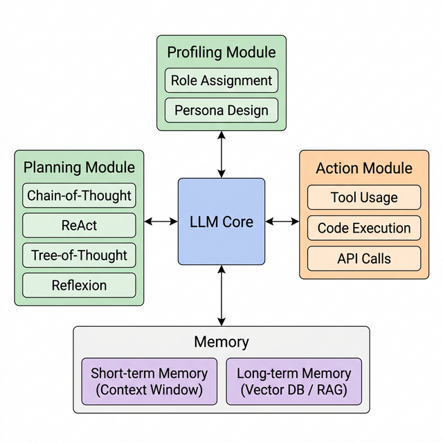
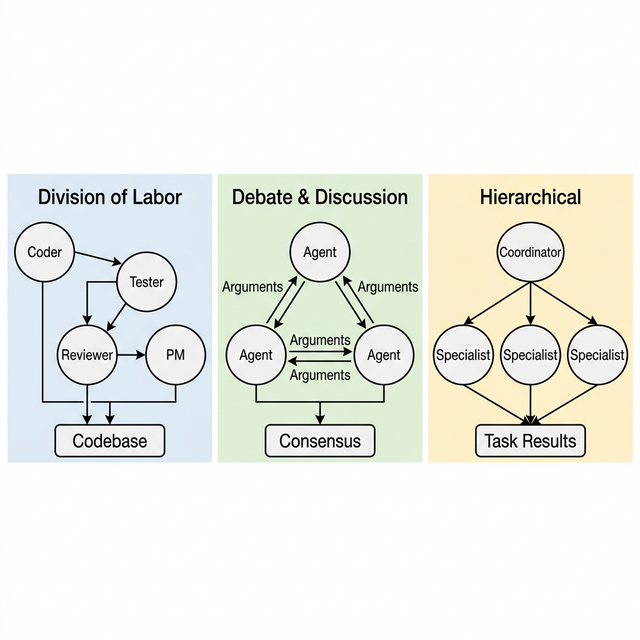

# A Survey on Large Language Model-Based Agents: Architecture, Memory, and Multi-Agent Collaboration

**Authors:** [Your Name]
**Date:** March 13, 2026
**Status:** Draft v1.0

---

## Abstract

Large Language Models (LLMs) have emerged as a foundational component for building autonomous agents capable of perceiving environments, making decisions, and executing complex tasks. This survey provides a comprehensive review of LLM-based agents, covering their architectural design, memory mechanisms, and multi-agent collaboration paradigms. We systematically analyze 15 representative works published between 2023 and 2025, categorizing agent architectures into profiling, planning, and action modules. We further examine memory systems ranging from in-context short-term memory to vector database-backed long-term memory, and explore emerging multi-agent frameworks that enable cooperative problem-solving. Finally, we discuss domain-specific applications in software engineering, finance, and gaming, alongside evaluation challenges and future research directions.

**Keywords:** Large Language Models, Autonomous Agents, Multi-Agent Systems, Memory Mechanism, Survey

---

## 1. Introduction

The rapid advancement of Large Language Models (LLMs), from GPT-3 to GPT-4 and beyond, has fundamentally transformed the landscape of artificial intelligence. While early applications focused on text generation and question answering, recent research has demonstrated that LLMs can serve as the cognitive core of autonomous agents—systems capable of perceiving their environment, reasoning about complex objectives, and taking actions to achieve specified goals (Wang et al., 2023).

The concept of AI agents is not new; it has roots in classical artificial intelligence dating back to the 1950s. However, the integration of LLMs has introduced a paradigm shift. Unlike traditional rule-based or reinforcement learning agents, LLM-based agents leverage the vast knowledge encoded during pre-training, enabling them to generalize across tasks without domain-specific training (Xi et al., 2023). This generalization capability, combined with emergent abilities such as in-context learning and chain-of-thought reasoning, has catalyzed a new wave of research into agent design and deployment.

The proliferation of LLM-based agents has been remarkable. Within just two years, the research community has witnessed the development of diverse agent frameworks spanning software engineering, scientific research, financial trading, and interactive gaming (Zhang et al., 2024). Concurrently, multi-agent systems have emerged as a promising direction, where multiple LLM-based agents collaborate, debate, and negotiate to solve problems beyond the capacity of any individual agent (Guo et al., 2024).

Despite this rapid progress, several fundamental challenges remain. Memory management in long-horizon tasks, reliable tool usage, evaluation methodology, and safety concerns continue to be active areas of research. This survey aims to provide a structured overview of the current state of LLM-based agents, synthesizing findings from 15 representative works to identify key architectural patterns, memory strategies, and collaboration mechanisms.

The remainder of this paper is organized as follows. Section 2 provides essential background on LLMs and agent concepts. Section 3 examines the architectural design of LLM-based agents. Section 4 discusses memory mechanisms. Section 5 explores multi-agent collaboration paradigms. Section 6 reviews domain-specific applications. Section 7 addresses evaluation and challenges, and Section 8 outlines future research directions.

---

## 2. Background

### 2.1 Large Language Models

Large Language Models are neural networks based on the Transformer architecture (Vaswani et al., 2017) that are pre-trained on massive text corpora. Models such as GPT-4, Claude, Gemini, and LLaMA have demonstrated remarkable capabilities in language understanding, generation, and reasoning. The scaling laws governing these models suggest that increasing model size and training data leads to emergent abilities, including few-shot learning, instruction following, and complex reasoning.

### 2.2 Agent Concepts

An agent, in the context of artificial intelligence, is defined as an entity that perceives its environment through sensors and acts upon it through actuators to achieve specified objectives. Classical agent architectures include reactive agents (Brooks, 1986), deliberative agents with symbolic reasoning, and hybrid architectures combining both approaches.

### 2.3 From Classical AI Agents to LLM-Based Agents

The key distinction between classical AI agents and LLM-based agents lies in the source of world knowledge and reasoning capability. Classical agents rely on hand-crafted knowledge bases and domain-specific algorithms, whereas LLM-based agents leverage the broad knowledge acquired during pre-training. Wang et al. (2023) formalize this distinction by defining LLM-based agents as systems where an LLM serves as the central controller, interfacing with memory modules, planning mechanisms, and external tools.

---

## 3. Agent Architecture

The architectural design of LLM-based agents has been extensively studied in recent surveys. Wang et al. (2023) propose a unified framework comprising three core modules: profiling, planning, and action. This framework, which has been cited over 2,400 times, serves as a foundational reference for subsequent research in the field.

*Figure 1: Unified architecture of LLM-based autonomous agents (adapted from Wang et al., 2023).*

### 3.1 Profiling Module

The profiling module determines the role and persona of an agent. By assigning specific identities through system prompts or few-shot examples, agents can be configured to exhibit domain-specific behaviors. For instance, a software engineering agent may be instructed to follow coding conventions, while a financial analyst agent may be guided to prioritize risk assessment (Wang et al., 2023). Xi et al. (2023) further categorize profiling strategies into handcrafting, LLM-generation, and dataset alignment methods.

### 3.2 Planning Module

The planning module enables agents to decompose complex tasks into manageable sub-tasks and devise execution strategies. Several reasoning paradigms have been proposed:

- **Chain-of-Thought (CoT):** Sequential step-by-step reasoning that improves problem-solving accuracy.
- **ReAct:** Interleaving reasoning and acting, allowing agents to dynamically adjust plans based on environmental feedback.
- **Tree-of-Thought (ToT):** Exploring multiple reasoning paths simultaneously and selecting the most promising one.
- **Reflexion:** Self-reflection mechanisms that enable agents to learn from past failures.

Xi et al. (2023) provide an extensive taxonomy of planning strategies, classifying them into single-path reasoning, multi-path reasoning, and external planner-assisted methods. Their survey, cited over 1,500 times, remains a key reference for understanding the planning capabilities of LLM-based agents.

### 3.3 Action Module

The action module determines how agents interact with their environment. Actions can be categorized into:

- **Internal Actions:** Reasoning, memory retrieval, and self-reflection performed within the LLM.
- **External Actions:** Tool usage (API calls, code execution, web browsing), physical actions (in embodied agents), and communication with other agents or humans.

The integration of tool usage has been particularly impactful. Frameworks such as ToolFormer, Gorilla, and TaskWeaver demonstrate that LLM agents can learn to invoke external tools effectively, extending their capabilities beyond pure language processing (Wang et al., 2023).

---

## 4. Memory Mechanism

Memory is a critical component for LLM-based agents, particularly in tasks requiring long-horizon planning and context retention. A comprehensive survey on memory mechanisms by Zhang et al. (2024) categorizes agent memory into short-term, long-term, and hybrid systems.

### 4.1 Short-Term Memory

Short-term memory in LLM-based agents primarily relies on the context window of the underlying model. Information from recent interactions, observations, and intermediate reasoning steps is maintained within the input prompt. However, context window limitations (typically 4K to 128K tokens) constrain the amount of information that can be retained, necessitating strategies such as summarization and selective attention (Zhang et al., 2024).

### 4.2 Long-Term Memory

To overcome context window limitations, long-term memory systems employ external storage mechanisms. Common approaches include:

- **Vector Databases:** Encoding past experiences as embeddings stored in databases like FAISS, Pinecone, or ChromaDB, enabling semantic retrieval of relevant memories.
- **Retrieval-Augmented Generation (RAG):** Combining information retrieval with LLM generation to access and utilize stored knowledge dynamically.
- **Structured Knowledge Bases:** Maintaining explicit knowledge graphs or relational databases that agents can query.

### 4.3 Hybrid Memory Architecture

State-of-the-art agent systems increasingly adopt hybrid memory architectures that combine short-term and long-term components. For example, an agent may maintain a working memory buffer within its context window while simultaneously indexing important observations in a vector database for future retrieval. Zhang et al. (2024) identify this hybrid approach as the most effective for complex, long-running tasks, reporting significant improvements in task completion rates compared to purely context-based or purely retrieval-based systems.

---

## 5. Multi-Agent Systems

The extension from single-agent to multi-agent systems represents a significant evolution in LLM-based agent research. Guo et al. (2024) present a comprehensive survey on LLM-based multi-agent systems, which has garnered over 750 citations, establishing a taxonomy of collaboration patterns and communication protocols.

### 5.1 Collaboration Patterns

Multi-agent collaboration can be classified into several paradigms:

- **Division of Labor:** Agents are assigned specialized roles (e.g., coder, tester, reviewer) and contribute their expertise to a shared objective. This pattern is exemplified by frameworks such as MetaGPT and ChatDev.
- **Debate and Discussion:** Multiple agents engage in structured debate to arrive at consensus or refine solutions. This approach has been shown to improve reasoning accuracy by exposing individual agent errors through peer critique.
- **Voting and Aggregation:** Agents independently generate solutions, which are then aggregated through voting or ranking mechanisms to produce a final answer.

*Figure 2: Multi-agent collaboration patterns in LLM-based systems (adapted from Guo et al., 2024).*

### 5.2 Communication Protocols

Effective multi-agent collaboration requires well-defined communication protocols. Guo et al. (2024) identify three primary communication topologies:

- **Centralized:** A coordinator agent manages communication between specialist agents.
- **Decentralized:** Agents communicate directly in peer-to-peer fashion.
- **Hierarchical:** Agents are organized in layers, with higher-level agents delegating to lower-level ones.

### 5.3 Representative Frameworks

Several influential multi-agent frameworks have been developed:

| Framework | Architecture | Key Feature |
|-----------|-------------|-------------|
| MetaGPT | Role-based | Standard Operating Procedures |
| ChatDev | Sequential | Software development pipeline |
| AutoGen | Flexible | Conversable agent abstraction |
| CAMEL | Dual-agent | Inception prompting |
| CrewAI | Crew-based | Task delegation and tools |

These frameworks demonstrate that multi-agent collaboration can achieve performance exceeding that of individual agents, particularly in complex software engineering and creative problem-solving tasks (Guo et al., 2024).

---

## 6. Domain Applications

LLM-based agents have been deployed across diverse domains, each presenting unique challenges and opportunities.

### 6.1 Software Engineering

Software engineering has emerged as one of the most active application domains for LLM-based agents. Agents such as SWE-Agent, Devin, and OpenHands demonstrate capabilities in code generation, debugging, testing, and code review. A dedicated survey on LLM-based agents for software engineering highlights the progression from simple code completion to autonomous end-to-end development workflows (Jin et al., 2024).

### 6.2 Financial Trading

LLM agents have been applied to financial markets for sentiment analysis, trading strategy generation, and portfolio management. Li et al. (2024) examine LLM agent applications in financial trading, noting that agents can process and synthesize information from news, social media, and financial reports to inform trading decisions. However, challenges related to hallucination, temporal reasoning, and regulatory compliance remain significant barriers to real-world deployment.

### 6.3 Gaming

Game environments serve as valuable testbeds for LLM-based agents due to their well-defined rules, clear objectives, and measurable performance metrics. A survey on LLM-based game agents examines applications ranging from text-based adventure games to complex strategy games like Minecraft and StarCraft, demonstrating the planning and adaptation capabilities of LLM agents in interactive settings (Liu et al., 2024).

### 6.4 Industrial Systems

Xia et al. (2023) present an early exploration of LLM agents in manufacturing, demonstrating a flexible modular production system enhanced with LLM agents. Their work shows that LLM agents can coordinate production modules, handle exceptions, and adapt to changing requirements in industrial settings, pointing toward broader adoption in autonomous systems.

---

## 7. Evaluation and Challenges

### 7.1 Evaluation Benchmarks

The evaluation of LLM-based agents presents unique challenges compared to traditional LLM evaluation. While standard benchmarks focus on language understanding and generation quality, agent evaluation must additionally assess planning effectiveness, tool usage accuracy, long-horizon task completion, and collaborative behavior. Chang et al. (2024) provide an extensive survey on LLM evaluation methods, covering knowledge and capability evaluation, alignment assessment, and safety testing, with over 2,150 citations reflecting the critical importance of this topic.

### 7.2 Safety and Privacy

As LLM-based agents gain access to external tools, APIs, and sensitive data, safety and privacy concerns become paramount. Zhang et al. (2024b) address this challenge with PrivacyAsst, a framework for safeguarding user privacy in tool-using LLM agents. Their work identifies key vulnerability vectors, including unintended data exposure through API calls, prompt injection attacks, and unauthorized action execution.

### 7.3 Current Limitations

Despite significant progress, LLM-based agents face several fundamental limitations:

- **Hallucination:** Agents may generate plausible but incorrect information, which can propagate through planning and action chains.
- **Context Window Constraints:** Long-horizon tasks may exceed the model's context capacity, leading to information loss.
- **Reliability:** Non-deterministic behavior makes it difficult to guarantee consistent agent performance.
- **Cost:** Running large models for extended agent interactions incurs significant computational costs.

---

## 8. Future Directions

Several promising research directions emerge from this survey:

1. **Adaptive Autonomy:** Developing agents that can dynamically adjust their level of autonomy based on task complexity and confidence, seamlessly transitioning between fully autonomous operation and human-guided collaboration.

2. **Continual Learning:** Enabling agents to learn from experience across sessions without requiring retraining, building persistent knowledge through interaction.

3. **Standardized Evaluation:** Establishing comprehensive benchmarks that measure agent capabilities across planning, execution, collaboration, and safety dimensions.

4. **Industrial Deployment:** Bridging the gap between research prototypes and production systems, addressing reliability, cost-efficiency, and regulatory requirements.

5. **Cross-Modal Agents:** Extending LLM-based agents to integrate vision, audio, and embodied perception for more versatile real-world applications.

---

## 9. Conclusion

This survey has provided a structured overview of LLM-based agents, examining their architectural design, memory mechanisms, multi-agent collaboration paradigms, and domain-specific applications. The field has witnessed rapid growth since 2023, with foundational surveys by Wang et al. (2023) and Xi et al. (2023) establishing core architectural frameworks. Memory systems have evolved from simple context-based approaches to sophisticated hybrid architectures, while multi-agent systems have demonstrated the power of collaborative problem-solving. Despite these advances, significant challenges remain in evaluation, safety, reliability, and cost-effectiveness. As the field continues to mature, the convergence of improved LLM capabilities, refined agent architectures, and robust evaluation methodologies promises to unlock new possibilities for autonomous AI systems across diverse domains.

---

## References

1. Wang, L., Ma, C., Feng, X., Zhang, Z., Yang, H., Zhang, J., Chen, Z., Tang, J., Chen, X., Lin, Y., Zhao, W.X., Wei, Z., & Wen, J.-R. (2023). A survey on large language model based autonomous agents. *Frontiers of Computer Science*, 18(6). DOI: 10.1007/s11704-024-40231-1

2. Xi, Z., Chen, W.-X., Guo, X.H., He, W., Ding, Y., Hong, B., Zhang, M., Wang, J., Jin, S., Zhou, E., et al. (2023). The rise and potential of large language model based agents: a survey. *Science China Information Sciences*. DOI: 10.1007/s11432-024-4222-0

3. Guo, T., et al. (2024). Large Language Model based Multi-Agents: A Survey of Progress and Challenges. *arXiv preprint*.

4. Zhang, Z., et al. (2024). A Survey on the Memory Mechanism of Large Language Model based Agents. *arXiv preprint*.

5. Chang, Y., et al. (2024). A Survey on Evaluation of Large Language Models. *ACM Transactions on Intelligent Systems and Technology*. DOI: 10.1145/3641289

6. Zhang, X., Xu, H., Ba, Z., Wang, Z., Hong, Y., Liu, J., Qin, Z., & Ren, K. (2024). PrivacyAsst: Safeguarding User Privacy in Tool-Using Large Language Model Agents. *IEEE Transactions on Dependable and Secure Computing*. DOI: 10.1109/tdsc.2024.3372777

7. Xia, Y., Shenoy, M., Jazdi, N., & Weyrich, M. (2023). Towards autonomous system: flexible modular production system enhanced with large language model agents. *IEEE ETFA 2023*. DOI: 10.1109/etfa54631.2023.10275362

8. Jin, W., et al. (2024). Large Language Model-Based Agents for Software Engineering. *arXiv preprint*.

9. Li, Z., et al. (2024). Large Language Model Agent in Financial Trading: A Survey. *arXiv preprint*.

10. Liu, Y., et al. (2024). A Survey on Large Language Model-Based Game Agents. *arXiv preprint*.

11. Xu, M., Niyato, D., Kang, J., Xiong, Z., Mao, S., Zhu, H., Kim, D.I., & Letaief, K.B. (2024). When Large Language Model Agents Meet 6G Networks: Perception, Grounding, and Alignment. *IEEE Wireless Communications*. DOI: 10.1109/mwc.005.2400019

12. Chen, S., et al. (2024). Large language models empowered agent-based modeling and simulation: a survey and perspectives. *Humanities and Social Sciences Communications*. DOI: 10.1057/s41599-024-03611-3

13. Hu, S., et al. (2025). Agentic Large Language Models, a Survey. *arXiv preprint*.

14. Wang, L., et al. (2024). If LLM Is the Wizard, Then Code Is the Wand: A Survey on How Code Empowers Large Language Models to Serve as Intelligent Agents. *arXiv preprint*.

15. Chen, S., et al. (2023). Large Language Models Empowered Agent-based Modeling and Simulation. *arXiv preprint*.
