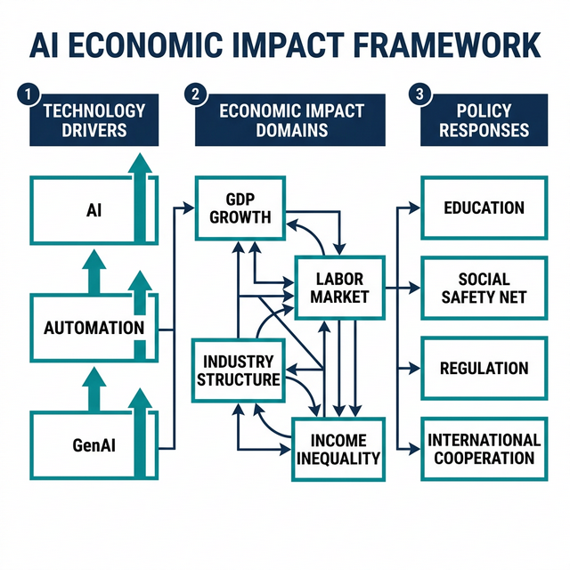
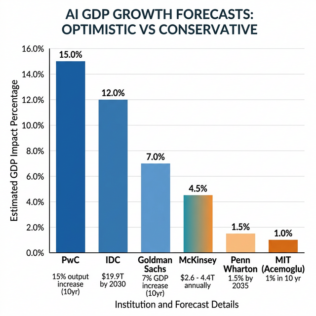

# AI 시대의 경제 미래: 거시경제, 노동시장, 산업구조의 전환에 관한 연구

**The Economic Future in the Age of AI: A Study on Macroeconomic, Labor Market, and Industrial Structure Transformation**

---

저자: NAVI Research System  
작성일: 2026년 3월 13일  
유형: Research Paper  
언어: 한국어  

---

## 초록

인공지능(AI) 기술은 18세기 산업혁명 이래 가장 근본적인 경제 패러다임의 전환을 예고하고 있다. 본 연구는 AI가 거시경제, 노동시장, 산업구조, 소득 분배에 미치는 다차원적 영향을 체계적으로 분석한다. Goldman Sachs는 생성형 AI가 글로벌 GDP를 7%(약 7조 달러) 증가시킬 수 있다고 전망하는 반면, MIT의 Acemoglu는 향후 10년간 GDP 증가 효과를 약 1%로 보수적으로 추정한다. 노동시장에서는 세계경제포럼이 2025~2030년 1억 7천만 개의 신규 일자리 창출과 9,200만 개의 일자리 대체를 예측하며, IMF는 전 세계 고용의 40%가 AI에 노출되어 있다고 경고한다. 본 연구는 이러한 전망의 차이를 비교 분석하고, 특히 한국 경제에 대한 시사점을 도출하며, AI 시대의 경제 정책 과제를 제시한다. 분석 결과, AI의 경제적 영향은 기술 자체보다 제도적 대응의 속도와 방향에 의해 결정될 가능성이 높으며, 교육 시스템 재설계, 사회 안전망 강화, 국제 협력 확대가 핵심 과제로 부각된다.

**핵심어:** 인공지능, 경제 미래, 노동시장, GDP, 자동화, 소득 불평등, 생성형 AI, 경제 정책

---

## 제1장. 서론

### 1.1 연구 배경

인류 문명의 경제사는 기술 혁신에 의한 패러다임 전환의 연속이다. 18세기 증기기관의 발명은 농업 중심 경제를 산업 경제로 전환시켰으며, 20세기 전기와 내연기관은 대량생산 체제를 확립했고, 20세기 후반의 디지털 혁명은 정보경제의 시대를 열었다. 이제 21세기의 인공지능(AI) 기술은 이전의 어떤 기술 혁명보다도 광범위하고 심대한 경제적 변화를 예고하고 있다.

특히 2022년 ChatGPT의 출시를 기점으로 촉발된 생성형 AI(Generative AI)의 급속한 발전은 AI의 경제적 영향에 대한 논의를 이론적 가능성에서 현실적 긴급성의 영역으로 전환시켰다. McKinsey Global Institute(2023)는 생성형 AI가 63개 활용 사례에 걸쳐 연간 2.6조에서 4.4조 달러의 가치를 창출할 수 있다고 추정하며, 이는 2021년 기준 영국의 전체 GDP에 필적하는 규모이다. IDC(2024)는 AI 관련 비즈니스 지출이 2030년까지 누적 19.9조 달러의 글로벌 경제적 영향을 미칠 것으로 전망하고 있다.

그러나 이러한 낙관적 전망과 함께 심각한 우려의 목소리도 동시에 제기되고 있다. MIT의 Daron Acemoglu(2024)는 AI의 GDP 증가 효과가 향후 10년간 약 1% 수준에 그칠 것이라는 보수적 전망을 제시하며, 기술의 생산성 향상 효과가 과대 추정되고 있을 가능성을 지적한다. IMF(2024)는 전 세계 고용의 약 40%가 AI에 노출되어 있으며, 이로 인한 소득 불평등 심화를 경고한다. 한국개발연구원(KDI)의 분석에 따르면, 국내 일자리의 38.8%에서 기술적으로 70% 이상의 업무가 자동화 가능한 것으로 추산된다.

이처럼 AI의 경제적 영향에 대해서는 낙관론과 비관론이 첨예하게 대립하고 있으며, 그 영향의 범위·속도·방향에 대한 합의는 아직 형성되지 않았다. 이러한 불확실성 속에서 정책 입안자, 기업, 개인이 올바른 의사결정을 내리기 위해서는 기존 연구의 종합적인 분석과 비판적 검토가 필수적이다.

### 1.2 연구 목적

본 연구의 목적은 다음 네 가지로 요약된다.

첫째, AI 기술 발전이 거시경제 지표, 특히 GDP 성장에 미치는 영향에 대한 주요 기관 및 학자들의 전망을 비교 분석한다. 둘째, AI 자동화가 노동시장에 미치는 영향을 직업 대체, 신규 창출, 임금 구조 변화의 관점에서 다층적으로 분석한다. 셋째, AI로 인한 산업구조 전환과 소득 불평등 메커니즘을 규명한다. 넷째, 이러한 분석을 바탕으로 한국 경제에 대한 시사점을 도출하고 정책적 제언을 제시한다.

### 1.3 연구 범위와 방법론

본 연구는 2020년 이후 발표된 주요 학술 논문, 국제기구 보고서, 컨설팅 기관 연구를 체계적으로 검토하는 문헌 연구(Systematic Literature Review) 방법론을 채택한다. 분석 대상은 IMF, World Bank, OECD 등 국제기구 보고서, Goldman Sachs, McKinsey, PwC 등 민간 연구기관 보고서, MIT, Stanford 등 학술 연구, 그리고 KDI, 한국노동연구원 등 국내 연구기관 보고서를 포함한다.

연구 범위는 시간적으로 현재(2026년)부터 2040년까지의 중장기 전망에 초점을 맞추며, 공간적으로는 글로벌 경제를 대상으로 하되, 특히 한국 경제에 대한 시사점 도출에 중점을 둔다.

### 1.4 논문의 구성

본 논문은 총 10장으로 구성된다. 제2장에서는 AI 기술 발전의 현황과 전망을 개관하고, 제3장에서 GDP 성장 전망을, 제4장에서 노동시장 영향을 분석한다. 제5장과 제6장에서는 각각 산업구조 전환과 소득 불평등 문제를 다루며, 제7장에서 경제 정책 과제를, 제8장에서 글로벌 경제 질서 재편을 논의한다. 제9장에서 한국 경제에 대한 시사점을 도출하고, 제10장에서 결론 및 제언을 제시한다.

---

## 제2장. AI 기술 발전의 현황과 전망

### 2.1 AI 기술 진화의 궤적

인공지능 기술의 발전은 크게 네 단계로 구분할 수 있다. 제1세대 AI(1950~1980년대)는 규칙 기반 전문가 시스템으로, 사전에 프로그래밍된 논리에 따라 동작하는 제한적인 시스템이었다. 제2세대 AI(1990~2010년대)는 머신러닝 기반으로, 데이터로부터 패턴을 학습하는 능력을 갖추었으나, 특정 과업에 한정된 '좁은 AI(Narrow AI)'에 머물렀다.

제3세대 AI(2017년~현재)는 트랜스포머(Transformer) 아키텍처의 등장과 대규모 언어 모델(Large Language Model, LLM)의 발전으로 대표된다. 2017년 Google의 "Attention Is All You Need" 논문을 시작으로, GPT-3(2020), GPT-4(2023), Gemini(2023~2024), Claude 3(2024) 등 점점 더 강력한 모델이 등장했다. 이러한 생성형 AI는 텍스트, 이미지, 코드, 음악 등 다양한 형태의 콘텐츠를 이해하고 생성하는 범용적 능력을 보유하고 있다.

제4세대 AI는 아직 실현되지 않았으나, 인간 수준 또는 그 이상의 범용 지능을 가진 인공일반지능(AGI, Artificial General Intelligence)으로의 발전이 예상된다. OpenAI, Google DeepMind, Anthropic 등 주요 AI 연구소는 AGI 개발을 궁극적 목표로 명시하고 있으며, 일부 전문가들은 2030년대에 AGI 수준의 AI가 등장할 수 있다고 전망한다.

이러한 기술 진화의 경제적 함의는 심대하다. 이전 세대의 AI가 주로 반복적·정형적 업무의 자동화에 기여했다면, 생성형 AI는 창의적·분석적·대인적 업무 영역까지 자동화의 범위를 확장하고 있다. 이는 AI의 경제적 영향이 제조업 중심의 블루칼라 직종을 넘어 서비스업 중심의 화이트칼라 직종으로 확대되고 있음을 의미한다.

### 2.2 생성형 AI의 경제적 특수성

생성형 AI가 이전의 기술과 구별되는 핵심적 경제적 특성은 다음 세 가지로 정리할 수 있다.

첫째, **범용성(General Purpose)**이다. 전통적인 자동화 기술은 특정 과업에 특화되어 있어 산업별로 별도의 기술 투자가 필요했다. 반면 생성형 AI는 하나의 모델이 프로그래밍, 법률 문서 작성, 의료 진단 보조, 고객 상담 등 광범위한 분야에 적용 가능하다. McKinsey(2023)의 분석에 따르면, 생성형 AI는 63개 이상의 활용 사례에서 경제적 가치를 창출할 수 있으며, 이는 이전의 분석 기반 AI보다 활용 범위가 현저히 넓다.

둘째, **인지적 업무의 자동화**이다. 과거의 산업용 로봇이 물리적 노동을 대체했다면, 생성형 AI는 분석, 판단, 창작 등 인지적 노동을 보완하거나 대체한다. Goldman Sachs(2023)는 미국 직업의 약 2/3가 AI 자동화에 어느 정도 노출되어 있으며, 해당 직종 업무량의 25~50%가 AI로 대체 가능하다고 추정한다. 이는 전통적으로 자동화로부터 안전하다고 여겨졌던 전문직·관리직에 대한 근본적 재평가를 요구한다.

셋째, **한계비용의 급격한 감소**이다. 디지털 기술의 일반적 특성과 마찬가지로, 생성형 AI 서비스는 초기 개발 비용이 막대하지만(GPT-4 학습 비용 추정치 $100M 이상), 한 번 학습된 모델의 추론(inference) 비용은 지속적으로 하락하고 있다. 이러한 비용 구조는 AI 활용이 대기업에서 중소기업·스타트업으로 빠르게 확산될 수 있는 경제적 기반을 제공한다.

### 2.3 AI 투자 현황 및 추세

AI에 대한 전 세계적 투자는 기하급수적으로 증가하고 있다. Stanford 대학교 인간중심 AI 연구소(HAI)의 AI Index Report(2024)에 따르면, 2023년 전 세계 AI 민간 투자에서 생성형 AI에 대한 투자는 252억 달러를 기록하여 전년 대비 약 8배 증가했다. Microsoft의 New Future of Work Report(2025)는 2024년 글로벌 AI 민간 투자 총액이 339억 달러로 전년 대비 18.7% 증가했다고 보고했다.

기업 수준에서도 AI 도입이 가속화되고 있다. Amundi Research Center의 분석에 따르면, 2024년 12월 기준 미국 기업의 6.0% 이상이 이미 생산 공정에 AI를 활용하고 있으며, 이는 1년 전 3.7%에서 크게 증가한 수치이다. 생성형 AI의 기업 사용률은 2023년 55%에서 2024년 75%로 급등했으며, IDC(2024)에 따르면 기업들은 생성형 AI에 투자한 1달러당 평균 3.7배의 투자수익률(ROI)을 달성하고, 선도 기업들은 10.3배의 ROI를 기록하고 있다.

한국수출입은행(2024)의 분석에 따르면, 미국의 빅테크 기업들이 초거대 AI 시대를 주도하면서 다른 국가들과의 기술 격차를 확대하고 있다. 이러한 투자 집중 현상은 AI의 경제적 효과가 국가 간, 기업 간 불균등하게 분배될 수 있음을 시사한다.

---

## 제3장. AI와 거시경제: GDP 성장 전망

### 3.1 낙관론: AI가 가져올 경제적 황금기

AI의 거시경제적 영향에 대한 가장 낙관적인 전망은 주로 글로벌 투자은행과 컨설팅 기관에서 제시되고 있다.

**Goldman Sachs**의 연구팀은 생성형 AI가 향후 10년간 글로벌 GDP를 7%(약 7조 달러) 증가시키고, 생산성 성장률을 1.5%p 끌어올릴 수 있다고 전망한다. 미국의 경우, AI 도입이 본격화되면 노동생산성이 연간 약 1.5%p 향상될 수 있으며, 잠재 GDP 성장률이 2025~2029년 평균 2.1%에서 2030년대 초반 2.3%로 가속할 것으로 예측한다.

**McKinsey Global Institute**(2023)는 더욱 구체적인 분석을 제시한다. 생성형 AI는 63개 활용 사례에 걸쳐 연간 2.6조~4.4조 달러의 경제적 가치를 추가할 수 있으며, 노동생산성 성장에 연간 0.1~0.6%p를 기여할 수 있다. 다른 자동화 기술과 결합할 경우, 연간 생산성 성장에 0.5~3.4%p의 기여가 가능하다. 또한 현재 근로자 업무 시간의 60~70%가 자동화 가능하며, 오늘날의 업무 활동 절반이 2030~2060년 사이(중앙값 2045년)에 자동화될 것으로 추정한다.

**PwC**는 AI가 향후 10년간 글로벌 경제 산출을 최대 15%p 증가시킬 수 있다고 전망하며, 이는 연간 성장률로 환산하면 추가 1%p에 해당한다. PwC의 Global AI Jobs Barometer(2025)에 따르면, AI 스킬을 보유한 근로자는 평균 56%의 임금 프리미엄을 누리고 있어, AI가 고숙련 노동자에게는 상당한 경제적 기회를 제공하고 있음을 보여준다.

**IDC**(2024)의 전망에 따르면, AI 관련 비즈니스 지출의 누적 글로벌 경제적 영향은 2030년까지 19.9조 달러에 달하며, 해당 연도 글로벌 GDP의 3.5%를 차지할 것으로 예상된다.

**Penn Wharton Budget Model**은 장기적 관점에서 AI의 GDP 영향을 분석하여, 2035년까지 1.5%, 2055년까지 약 3%, 2075년까지 3.7%의 GDP 증가 효과를 전망한다. 이 모델은 현재 GDP의 약 40%가 생성형 AI에 의해 잠재적으로 영향받을 수 있다고 추정한며, 이는 AI의 경제적 침투가 매우 광범위할 수 있음을 시사한다.

### 3.2 현실론: AI 경제 효과의 과대 추정 가능성

낙관적 전망에 대한 가장 체계적인 비판은 MIT의 Daron Acemoglu 교수(2024)에 의해 제시된다. Acemoglu는 AI가 GDP에 미치는 영향이 "무시할 수 없지만 겸손한(nontrivial but modest)" 수준에 그칠 것이라고 주장하며, 향후 10년간 GDP 증가 효과를 약 1%, 현실적 최대치를 약 1.1%로 추정한다.

이러한 보수적 전망의 근거로 Acemoglu는 다음 사항을 제시한다. 첫째, 기술 채택에는 상당한 시간이 소요된다. 역사적으로 증기기관, 전기, 컴퓨터 등 범용 기술(GPT, General Purpose Technology)은 경제 전반에 확산되어 생산성 향상으로 이어지기까지 수십 년이 소요되었다. AI도 이러한 패턴을 따를 가능성이 높다. 둘째, 자동화가 가능한 업무와 경제적으로 자동화가 바람직한 업무 사이에는 괴리가 존재한다. 기술적으로 자동화 가능하더라도 구현 비용, 조직 저항, 규제 등의 요인으로 실제 자동화는 제한적일 수 있다. 셋째, AI가 생산하는 결과물의 품질 문제이다. 생성형 AI의 '환각(hallucination)' 문제 등으로 인해 전문적 판단이 필요한 분야에서의 완전한 자동화는 단기적으로 어렵다.

미국 의회예산국(CBO)도 AI가 경제 성장, 고용, 임금에 영향을 미칠 수 있음을 인정하면서도, 그 영향의 방향·규모·시점에 대한 불확실성이 상당하다는 점을 강조한다.

### 3.3 생산성 역설의 재현 가능성

현재의 AI 논의에서 간과되기 쉬운 것이 '생산성 역설(Productivity Paradox)'의 재현 가능성이다. 1987년 Robert Solow는 "컴퓨터 시대가 도처에서 보이지만, 생산성 통계에서는 보이지 않는다(You can see the computer age everywhere but in the productivity statistics)"라는 유명한 역설을 제시했다. 이후 수십 년간 IT 투자가 거시적 생산성 향상으로 이어지지 않는 현상이 관찰되었으며, 2000년대 이후에야 IT의 생산성 향상 효과가 본격적으로 나타났다.

AI에 대해서도 유사한 역설이 관찰될 수 있다. 막대한 투자에도 불구하고, 거시적 생산성 지표에서 AI의 효과가 명확히 나타나지 않을 가능성이 있다. 이는 AI 도입에 따른 보완적 투자(조직 재설계, 인력 재교육, 인프라 구축)가 병행되어야 하며, 이러한 전환 비용이 단기적으로 생산성 향상을 상쇄할 수 있기 때문이다.

그러나 Amundi Research Center의 분석은 이 역설이 AI 시대에는 단기화될 수 있다고 제안한다. 미국의 경우, AI가 향후 10년간 노동생산성을 연간 약 1%p 향상시키고, GDP 성장에 약 0.35%p를 기여할 것으로 전망되며, 이는 디지털화의 생산성 효과보다 더 빠르게 현실화될 수 있다.

### 3.4 국가별 GDP 영향 비교

AI의 경제적 영향은 국가별로 현저한 차이를 보일 것으로 전망된다.

**선진국(미국, EU, 일본, 한국 등)**은 높은 기술 인프라, 풍부한 인적 자본, 발달한 AI 생태계를 바탕으로 AI의 생산성 향상 효과를 가장 먼저, 가장 크게 향유할 것으로 예상된다. 특히 미국은 주요 AI 기업의 본거지, 세계 최대의 벤처캐피털 시장, 우수 연구 인력 등의 이점으로 AI 경제 효과의 최대 수혜국이 될 것으로 전망된다.

**중국**은 풍부한 데이터, 정부의 적극적인 AI 산업 육성 정책, 방대한 내수 시장을 바탕으로 미국에 이은 제2의 AI 강국으로 부상하고 있다. 그러나 미·중 기술 경쟁으로 인한 반도체 수출 규제, 데이터 주권 이슈 등이 변수로 작용할 수 있다.

**개발도상국**의 경우, IMF(2024)의 분석에 따르면 AI의 성장 효과가 선진국의 절반 수준에 그칠 수 있으며, 이는 국가 간 소득 불평등을 심화시킬 우려가 있다. 디지털 인프라 부족, AI 인재 유출, 자국어 데이터 부족 등이 주요 장애 요인으로 작용한다. 다만 World Bank는 개발도상국에서도 AI 스킬에 대한 수요가 2021년에서 2024년 사이 9배 증가했다고 보고하며, 후발 주자의 빠른 추격 가능성도 시사한다.

**한국**의 경우, 높은 IT 인프라 수준과 교육열을 바탕으로 AI 도입이 빠르게 진행되고 있으나, 대기업-중소기업 간 AI 도입 격차, 규제 환경, 인구 구조 등이 도전 과제로 남아 있다. 한국의 AI 산업 발전이 경제 성장에 미치는 효과에 관한 연구에 따르면, AI 산업의 발전은 약 1년의 시차를 두고 GDP 성장에 긍정적인 영향을 미치며, 특히 대정부 AI 매출이 민간 부문보다 GDP 성장에 더 큰 영향을 미치는 것으로 나타났다.

---

## 제4장. AI와 노동시장: 자동화와 일자리의 미래

### 4.1 AI 자동화의 새로운 특질: 화이트칼라 중심

과거의 자동화 기술이 주로 제조업의 단순 반복 업무를 대상으로 했다면, AI, 특히 생성형 AI에 의한 자동화는 근본적으로 다른 양상을 보인다. 가장 두드러진 특징은 자동화의 대상이 블루칼라에서 화이트칼라로 전환되고 있다는 점이다.

Anthropic이 2026년 3월 공개한 '노동시장에 대한 AI의 영향' 보고서에 따르면, AI에 의해 대체될 확률이 가장 높은 직업군은 컴퓨터 프로그래머로 나타났다. 고객 서비스 담당자, 데이터 입력 작업자 등도 높은 자동화 노출도를 보였다. 이는 전통적인 자동화가 육체 노동을 대상으로 했던 것과 대비되는 현상으로, 고학력·고소득 화이트칼라 직종이 오히려 AI에 의한 대체 위험이 더 높을 수 있음을 시사한다.

Penn Wharton Budget Model의 분석은 이러한 추세를 정량적으로 확인한다. 현재 소득 분위에서 약 80번째 백분위에 해당하는 직종, 즉 상위 중산층 수준의 소득을 버는 직종이 생성형 AI 자동화에 가장 크게 노출되어 있다. 이는 과거의 자동화가 주로 저소득·저숙련 직종을 위협했던 것과는 상반되는 패턴이다.

한국에서도 이러한 추세가 관찰된다. 산업연구원은 AI로 인한 산업 전환이 기존의 자동화와는 다르게 매우 빠르고 전방위적으로 노동 수요를 대체할 파급력을 가질 수 있다고 경고한다. 이전의 기계화·자동화가 수십 년에 걸쳐 점진적으로 진행된 반면, AI에 의한 인지 노동의 자동화는 소프트웨어 배포의 속도로 진행될 수 있다는 점에서 질적으로 다른 도전을 제기한다.

### 4.2 직업별 대체 위험도 분석

AI 자동화에 대한 직업별 노출도는 업무의 성격에 따라 크게 다르다. Goldman Sachs(2023)의 분석에 따르면, 미국 직업의 약 3분의 2가 AI 자동화에 어느 정도 노출되어 있으며, 해당 직종 업무량의 25%에서 50%가 AI로 대체 가능하다.

**고위험 직종**으로는 행정 지원, 법률 보조, 금융 분석, 고객 서비스, 데이터 입력, 기초 프로그래밍 등이 분류된다. 이들 직종은 정형화된 규칙에 따른 정보 처리, 패턴 인식, 텍스트 생성 등 AI가 잘 수행하는 업무가 핵심 직무를 구성한다.

**중위험 직종**으로는 의료 전문직, 교육직, 엔지니어링, 관리직 등이 해당된다. 이들 직종에서 AI는 업무의 일부를 보완하거나 효율화할 수 있으나, 인간의 판단·공감·창의성이 필요한 핵심 업무는 단기적으로 대체가 어렵다.

**저위험 직종**은 육체적 현장 작업이 많은 건설, 유지보수, 간병, 요리 등의 직종이다. 이들 직종은 현재의 AI·로봇 기술 수준에서 자동화가 어려운 비정형적 물리 업무로 구성되어 있다.

IMF(2024)는 글로벌 차원에서 고용의 약 40%가 AI에 노출되어 있으며, 선진국에서는 이 비율이 더 높다고 분석한다. 선진국의 경우 약 30%의 일자리가 AI에 의한 고위험 대체에 처해 있는 반면, 신흥시장에서는 20%, 저소득국에서는 18%로 상대적으로 낮다. 이는 선진국의 경제 구조가 서비스업·지식경제 중심으로 편중되어 있어 AI의 인지 자동화 영향을 더 크게 받기 때문이다.

### 4.3 신규 일자리 창출 vs 기존 일자리 대체

AI의 노동시장 영향은 단순한 일자리 대체로 환원될 수 없으며, 신규 일자리 창출과의 역학적 관계 속에서 이해되어야 한다.

세계경제포럼(WEF)의 Future of Jobs Report 2025에 따르면, 2025년에서 2030년 사이 구조적 노동시장 전환이 현재 일자리의 22%에 영향을 미칠 것으로 전망된다. 구체적으로 1억 7천만 개의 신규 일자리가 창출되고 9,200만 개의 일자리가 대체되어, 순증 7%인 7,800만 개의 일자리가 늘어날 것으로 예측된다.

이러한 순증 전망에도 불구하고, '전환의 고통(transition costs)'은 상당할 수 있다. 대체되는 일자리의 근로자가 새로 창출되는 일자리에 적합한 역량을 보유하지 못할 경우, 구조적 실업이 발생한다. 특히 AI 시대에 요구되는 역량은 분석적·기술적·창의적 능력으로, 기존의 정형적 업무 수행 능력과는 질적으로 다르다.

Harvard Business School의 연구에 따르면, ChatGPT 출시 이후 높은 자동화 가능성을 가진 직종의 채용 공고는 13% 감소한 반면, 분석적·기술적·창의적 업무를 요구하는 직종의 채용 수요는 20% 증가했다. 이는 AI가 단순히 일자리를 대체하는 것이 아니라, 노동시장의 수요 구조 자체를 재편하고 있음을 보여준다.

MIT의 연구팀은 AI의 영향이 전체 직업 단위가 아닌, 직업 내 특정 업무(task) 단위에서 작용한다는 점을 강조한다. 즉, AI는 대부분의 경우 직업 전체를 대체하는 것이 아니라, 직업 내에서 AI가 수행하기 적합한 업무를 자동화함으로써 근로자가 AI에 적합하지 않은 업무에 집중할 수 있도록 한다. 이러한 '업무 재분배(task reallocation)' 관점은 AI의 노동시장 영향을 보다 정밀하게 이해하는 데 기여한다.

### 4.4 기술 격차와 임금 프리미엄

AI 시대의 핵심적 노동시장 현상 중 하나는 AI 관련 기술을 보유한 근로자와 그렇지 못한 근로자 사이의 임금 격차 확대이다.

PwC의 Global AI Jobs Barometer(2025)에 따르면, AI 스킬을 보유한 근로자는 평균적으로 56%의 임금 프리미엄을 향유하고 있다. 이러한 프리미엄은 AI 관련 직종뿐 아니라, AI를 활용하여 업무 생산성을 높이는 다양한 직종에서 관찰된다. 흥미롭게도, 고객 서비스와 같이 높은 자동화 가능성을 가진 직종에서도 임금이 오히려 상승하는 현상이 관찰되는데, 이는 AI가 이들 직종에서 단순 대체보다는 업무 증강(augmentation)의 역할을 하고 있음을 시사한다.

디지털, 인지, 창의 분야에서 새로운 기술이 부상하고 있으며, 이에 따라 유연한 적응력과 평생학습의 중요성이 강조되고 있다. 기존의 교육 시스템으로는 AI 시대에 요구되는 역량을 충분히 육성하기 어려우며, 재교육(reskilling)과 상향 교육(upskilling) 프로그램의 확대가 시급한 과제이다.

### 4.5 한국 노동시장에 대한 시사점

한국의 노동시장은 AI 시대에 특수한 취약성과 기회를 동시에 가지고 있다.

한국노동연구원의 보고서에 따르면, 2022년에서 2024년 사이 AI 노출도가 높은 직종에서 15~29세 청년 고용 지표가 15% 감소했다. 또한 AI 도입률이 높은 기업일수록 청년 고용 증가율이 2023년 이후 정체되고 있다. 이는 AI 도입이 신규 채용의 감소를 통해 노동시장에 영향을 미치고 있음을 시사하며, 특히 노동시장에 진입하는 청년층에게 더 큰 영향을 미칠 수 있음을 보여준다.

KDI의 분석에 따르면, 2023년 현재 국내 일자리의 38.8%에서 기술적으로 70% 이상의 업무를 자동화할 수 있는 것으로 추산된다. 이 수치는 한국의 높은 서비스업 비중과 디지털 인프라 수준을 반영하는 것으로, OECD 평균인 약 27%를 크게 상회한다.

다만 Anthropic의 연구는 실업률 데이터에서는 AI의 영향이 아직 통계적으로 명확하게 나타나지 않는다고 지적하며, 청년층의 고용 데이터에서만 이상 징후를 발견했다. 이는 AI의 노동시장 영향이 아직 초기 단계에 있으며, 본격적인 영향은 향후 3~5년간 점진적으로 나타날 수 있음을 시사한다.

한국의 경우, 빠른 고령화와 생산가능인구 감소 추세가 AI 도입의 긍정적 요인으로 작용할 수 있다. 노동력 부족이 심화되는 상황에서 AI는 생산성 유지의 핵심 수단이 될 수 있으며, 이는 AI가 일자리를 '빼앗는' 것이 아니라 '채우는' 역할을 할 수 있음을 의미한다.

---

## 제5장. AI와 산업구조 전환

### 5.1 AI 도입에 따른 산업별 영향 차등

AI가 산업구조에 미치는 영향은 산업별로 현저한 차이를 보인다. McKinsey(2023)의 분석에 따르면, AI의 경제적 가치 창출이 가장 큰 산업은 금융 서비스, 기술·미디어·통신, 생명과학·제약, 전문 서비스(컨설팅, 법률, 회계) 순이다.

**금융 서비스 산업**은 AI 도입의 최전선에 위치한다. 리스크 평가, 사기 탐지, 알고리즘 트레이딩, 개인화된 금융 상품 추천 등에서 AI의 활용이 급속히 확대되고 있다. 생성형 AI의 등장으로 보고서 작성, 고객 커뮤니케이션, 규제 준수 문서 생성 등 인지적 업무의 자동화도 가속화되고 있다.

**의료·헬스케어 산업**에서는 AI가 진단 정확도 향상, 신약 개발 기간 단축, 개인 맞춤형 치료 설계 등에 활용되고 있다. 특히 AI 기반 의료 영상 분석은 일부 영역에서 전문의 수준의 진단 정확도를 달성하고 있으며, AI를 활용한 신약 후보물질 발견은 전통적 방법 대비 개발 기간을 수년 단축할 수 있다.

**제조업**에서는 예측 정비, 품질 관리, 공급망 최적화 등에 AI가 활용되며, 디지털 트윈(Digital Twin) 기술과 결합하여 제조 공정의 효율성을 혁신적으로 향상시키고 있다. 다만 물리적 작업이 중심인 제조 현장에서의 AI 도입은 로봇 기술의 발전 속도에 의존하는 측면이 있다.

**농업**은 AI 도입이 상대적으로 느린 산업 중 하나이나, 정밀 농업(Precision Agriculture) 기술의 발전으로 작물 질병 조기 감지, 최적 관개·시비 계획, 수확량 예측 등에서 AI의 활용이 점진적으로 확대되고 있다.

### 5.2 AI 네이티브 산업의 부상

AI 기술을 기반으로 완전히 새로운 산업 영역이 형성되고 있다. 이른바 'AI 네이티브(AI-Native)' 산업은 AI가 부수적 도구로 활용되는 것이 아니라, 비즈니스 모델의 핵심을 구성하는 산업을 의미한다.

대표적인 AI 네이티브 산업으로는 AI 모델 개발 및 서비스(OpenAI, Anthropic, Google DeepMind 등), AI 인프라(GPU 칩, 클라우드 컴퓨팅, 데이터센터), AI 기반 콘텐츠 생성(이미지, 영상, 음악, 텍스트), AI 보안 및 안전(AI 모니터링, 편향 감지, 안전성 평가), 자율시스템(자율주행, 드론, 로봇) 등이 있다.

Stanford HAI(2024)에 따르면 2023년 생성형 AI에 대한 민간 투자가 252억 달러로 전년 대비 8배 증가한 것은 이 분야의 폭발적 성장을 반영한다. Microsoft(2025)의 보고서는 2024년 글로벌 AI 민간 투자가 339억 달러에 이르렀다고 보고하는데, 이는 AI 네이티브 산업이 글로벌 경제에서 차지하는 비중이 급속히 확대되고 있음을 보여준다.

### 5.3 전통 산업의 AI 전환 전략

전통 산업에서의 AI 도입은 단순한 기술 도입을 넘어 비즈니스 모델의 근본적 전환을 요구한다. IDC(2024)에 따르면, AI에 집중적으로 투자한 기업들은 생성형 AI에 투자한 1달러당 평균 3.7배의 ROI를 달성하고 있으며, 선도 기업 그룹은 10.3배의 ROI를 기록하고 있다. 이러한 ROI 격차는 AI 도입의 성공이 기술 자체보다 조직 전략·문화·역량의 전환에 의해 결정됨을 시사한다.

성공적인 AI 전환의 핵심 요소로는 첫째, 데이터 인프라의 정비가 필요하다. AI의 성능은 학습 데이터의 품질과 양에 크게 의존하므로, 체계적인 데이터 수집·관리·활용 체계의 구축이 선행되어야 한다. 둘째, 인적 자본의 재편이 요구된다. AI를 효과적으로 활용하기 위해서는 기존 인력의 AI 리터러시 향상과 함께, AI 전문 인력의 확보가 필요하다. 셋째, 조직 문화의 변화가 수반되어야 한다. AI 도입은 기존의 의사결정 프로세스, 업무 흐름, 성과 평가 체계 등의 변화를 요구하며, 이에 대한 조직적 저항을 극복해야 한다.

### 5.4 플랫폼 경제와 AI의 결합

AI는 기존의 디지털 플랫폼 경제를 더욱 강화하고 확장하는 방향으로 작용하고 있다. 대규모 AI 모델의 개발에는 막대한 컴퓨팅 자원과 데이터가 필요하며, 이는 이미 이러한 자원을 보유한 빅테크 기업들의 경쟁 우위를 더욱 공고히 할 수 있다.

한국수출입은행(2024)의 분석에 따르면, 미국의 빅테크 기업들이 초거대 AI 시대를 주도하면서 다른 국가 기업들과의 격차가 확대되고 있다. Microsoft, Google, Amazon, Meta 등은 AI 모델 개발, 클라우드 인프라, 응용 서비스의 전 가치사슬을 수직 통합하면서, AI 생태계에서의 지배적 지위를 확립하고 있다.

이러한 현상은 '승자 독식(Winner Takes All)' 경향을 강화할 수 있으며, 중소기업과 스타트업의 경쟁력을 약화시킬 우려가 있다. 그러나 동시에, 오픈소스 AI 모델의 확산(Meta의 Llama, Google의 Gemma 등)과 API 기반 AI 서비스의 보편화는 진입 장벽을 낮추는 효과도 있어, 플랫폼 경제의 독점화와 민주화가 동시에 진행되는 양상을 보이고 있다.

---

## 제6장. AI와 소득 불평등

### 6.1 기술 편향적 변화와 소득 양극화

AI 시대의 소득 불평등은 '기술 편향적 기술 변화(Skill-Biased Technological Change, SBTC)' 이론의 연장선에서 이해할 수 있다. SBTC 이론에 따르면, 새로운 기술은 고숙련 노동에 대한 수요를 증가시키고 저숙련 노동에 대한 수요를 감소시킴으로써 소득 격차를 확대한다.

그러나 AI에 의한 기술 변화는 전통적인 SBTC 패턴과는 다른 양상을 보인다. 앞서 논의한 바와 같이, 생성형 AI는 고숙련·고소득 직종을 오히려 더 크게 위협하고 있다. Penn Wharton의 분석에 따르면, 소득 분포의 80번째 백분위에 해당하는 직종이 AI 자동화에 가장 크게 노출되어 있다. 이는 AI가 전통적 의미의 '숙련-비숙련' 구분이 아닌, '정형적 인지 업무-비정형적 업무'의 구분에 따라 차별적 영향을 미치고 있음을 의미한다.

결과적으로, AI 시대의 소득 양극화는 이중적 구조를 가질 수 있다. 한편으로, AI를 효과적으로 활용할 수 있는 고숙련 근로자와 AI 전문가는 높은 임금 프리미엄을 향유하게 된다. 다른 한편으로, AI에 의해 업무가 자동화되지만 AI를 활용한 업무 전환이 어려운 중·고소득 근로자 계층이 새로운 취약 계층으로 부상할 수 있다.

### 6.2 AI 스킬 프리미엄과 노동시장 이중구조

PwC(2025)의 분석에 따르면, AI 스킬을 보유한 근로자는 평균 56%의 임금 프리미엄을 향유하고 있다. 이러한 프리미엄은 단순히 AI 개발자나 데이터 과학자에 한정되지 않으며, AI 도구를 활용하여 업무 생산성을 높이는 다양한 직종에서 관찰된다.

이러한 AI 스킬 프리미엄의 존재는 노동시장의 이중구조화를 촉진할 수 있다. AI 활용 역량을 갖춘 '디지털 숙련(digitally skilled)' 근로자와 그렇지 못한 '디지털 비숙련(digitally unskilled)' 근로자 사이의 생산성 격차가 확대되면, 이는 필연적으로 임금 격차와 고용 안정성의 차이로 이어진다.

특히 우려되는 점은 이러한 AI 스킬 격차가 기존의 사회경제적 불평등과 중첩될 수 있다는 것이다. 양질의 디지털 교육에 접근할 수 있는 사회경제적 여건을 가진 집단은 AI 시대의 수혜자가 될 가능성이 높은 반면, 그렇지 못한 집단은 경제적 소외가 심화될 수 있다. 이는 AI에 의한 소득 불평등이 기존의 교육·소득·지역 격차를 강화하는 악순환 구조를 형성할 수 있음을 시사한다.

### 6.3 국가 간 디지털 격차와 AI 격차

AI의 경제적 효과가 국가별로 불균등하게 분배될 수 있다는 점은 글로벌 차원의 불평등 심화를 우려하게 하는 요인이다.

IMF(2024)의 분석에 따르면, AI의 경제 성장 효과는 선진국에서 가장 크게 나타나고, 저소득국에서는 그 효과가 선진국의 절반 수준에 그칠 수 있다. 이는 디지털 인프라, 인적 자본, 제도적 환경 등에서의 기존 격차가 AI 시대에 더욱 확대될 수 있음을 의미한다.

구체적으로, 선진국의 약 60%의 일자리가 AI에 노출되어 있으나, 이 중 절반은 AI에 의해 업무가 증강되어 오히려 생산성과 임금이 향상될 수 있다. 반면 저소득국에서는 AI 노출도가 26%로 낮아 자동화에 따른 직접적 일자리 손실 위험은 적지만, 동시에 AI에 의한 생산성 향상의 혜택도 제한적이다.

World Bank는 개발도상국에서 AI 스킬에 대한 수요가 2021년에서 2024년 사이 9배 증가했다고 보고하며, 이는 개도국에서도 AI 활용에 대한 인식이 빠르게 확산되고 있음을 보여준다. 특히 상위 중소득국에서는 AI 스킬 수요가 16% 증가하고, 하위 중소득국에서도 11% 증가한 반면, 고소득국에서는 2% 증가에 그쳤다. 이는 후발 국가들의 빠른 추격 가능성을 시사하지만, 절대적인 AI 역량 수준에서의 격차는 여전히 상당하다.

### 6.4 AI 시대의 부의 집중

AI 기술의 발전은 경제적 가치의 생산과 분배 구조를 근본적으로 변화시킬 수 있다. AI 모델 개발에 필요한 막대한 자본(컴퓨팅 인프라, 데이터, 인재)은 소수의 대기업에 집중되어 있으며, AI가 창출하는 경제적 가치의 상당 부분이 이들 기업과 주주에게 귀속될 수 있다.

Microsoft, Google, Amazon, Meta, Apple 등 빅테크 기업들의 시가총액은 AI 붐과 함께 전례 없는 수준으로 증가했으며, 이는 자본 소유자와 노동 제공자 사이의 부의 격차를 확대하는 요인으로 작용한다. AI에 의한 생산성 향상의 과실이 임금 상승보다는 기업 이윤과 주가 상승의 형태로 분배될 경우, '자본-노동' 간 분배 비율의 변화는 소득 불평등의 구조적 심화를 초래할 수 있다.

이러한 부의 집중 현상은 민주주의와 사회 안정에 대한 위협으로도 작용할 수 있다. AI 기술의 소유와 통제가 소수에게 집중될수록, 경제적 의사결정의 민주성이 약화되고, 사회적 갈등이 심화될 가능성이 있다.

---

## 제7장. AI 시대의 경제 정책 과제

### 7.1 교육 및 인적자본 정책

AI 시대의 가장 시급한 정책 과제는 교육 시스템의 근본적 재설계이다. 현행 교육 시스템은 산업화 시대의 요구에 맞춰 설계된 것으로, 정형화된 지식의 전달과 반복적 업무 수행 능력의 배양에 초점이 맞추어져 있다. 그러나 AI가 정형적 인지 업무를 자동화하는 시대에는 비판적 사고, 창의성, 복잡한 문제 해결, 사회적·감성적 지능 등 AI가 수행하기 어려운 역량이 핵심 경쟁력이 된다.

WEF의 Future of Jobs Report 2025는 2025년에서 2030년을 전후하여 분석적·기술적·창의적 역량에 대한 수요가 급증할 것으로 전망하며, 기존 근로자의 대규모 재교육(reskilling) 필요성을 강조한다. 구체적인 교육 정책의 방향으로는 다음 사항이 제안된다.

첫째, AI 리터러시의 보편화이다. AI의 원리, 가능성, 한계에 대한 기본적 이해는 모든 시민에게 필요한 역량이 되고 있다. 초·중·고등 교육 과정에 AI 리터러시를 통합하고, 비전공자를 위한 AI 활용 교육을 확대해야 한다.

둘째, 평생학습 체계의 구축이다. AI 기술의 빠른 발전 속도를 고려할 때, 단일 시점의 교육으로는 충분하지 않다. 직업 생애 전반에 걸친 지속적 학습을 가능하게 하는 제도적 지원(학습 휴가, 교육 바우처, 온라인 학습 플랫폼 등)이 필요하다.

셋째, 대학 교육의 혁신이다. 전공 구분의 경직성을 완화하고, AI와 인문학·사회과학·예술의 융합 교육을 강화해야 한다. AI를 활용한 교육 방법론의 혁신도 함께 추진되어야 한다.

### 7.2 사회 안전망 재설계

AI에 의한 일자리 전환은 기존의 사회 안전망 체계에 대한 근본적인 재검토를 요구한다. 전통적인 사회보험 체계는 '완전고용'에 가까운 경제 구조와 장기 근속을 전제로 설계된 것으로, AI 시대의 유동적 노동시장에는 적합하지 않을 수 있다.

IMF와 World Bank 모두 AI 시대의 사회 안전망 강화에 대한 전략적 정책 개입의 필요성을 강조한다. 구체적 정책 방향으로는 실업보험의 확대와 전직 지원 서비스의 강화가 필요하다. AI에 의해 일자리를 잃은 근로자가 새로운 직종으로 전환하는 과정에서의 소득 보전과 직업 훈련을 지원해야 한다.

보편적 기본소득(Universal Basic Income, UBI)에 대한 논의도 AI 시대에 새로운 맥락을 가지게 된다. AI에 의한 대규모 일자리 대체가 현실화될 경우, 전통적인 고용 중심의 소득 분배 체계만으로는 사회 구성원의 기본적 생활을 보장하기 어려울 수 있다. UBI나 부의 소득세(Negative Income Tax) 등 대안적 소득 보장 제도에 대한 본격적인 정책 실험과 연구가 필요하다.

기그 경제(Gig Economy)와 플랫폼 노동의 확산에 대응하는 새로운 형태의 사회 보장 체계도 마련되어야 한다. AI가 촉진하는 프리랜서·프로젝트 기반 고용 형태에서도 근로자가 적절한 사회적 보호를 받을 수 있도록 고용 형태에 중립적인(employment-neutral) 사회 안전망이 설계되어야 한다.

### 7.3 AI 거버넌스와 규제

AI의 경제적 활용이 확대됨에 따라, 적절한 거버넌스와 규제 프레임워크의 확립이 중요한 정책 과제로 부상하고 있다. 규제의 핵심 도전은 '혁신의 촉진'과 '위험의 관리' 사이에서 균형을 맞추는 것이다.

EU의 AI Act(인공지능법)는 위험 기반(risk-based) 접근법을 채택하여, AI 시스템을 위험도에 따라 분류하고 차등적 규제를 적용하는 모델을 제시하고 있다. 미국은 행정명령을 통해 AI 안전성과 보안에 대한 가이드라인을 제시하면서도, 민간 주도의 자율 규제에 상대적으로 더 큰 비중을 두고 있다. 중국은 생성형 AI 서비스 관리 잠정 조치 등을 통해 보다 직접적인 규제 개입을 하고 있다.

한국의 경우, AI 규제와 관련하여 '규제 샌드박스'를 활용한 유연한 접근이 필요하다. 과도한 규제는 AI 산업의 발전을 저해할 수 있으며, 과소한 규제는 사회적 위험을 증가시킬 수 있다. 특히 고용·노동, 금융, 의료 등 핵심 분야에서의 AI 활용에 대한 구체적인 가이드라인 마련이 시급하다.

### 7.4 AI 시대의 조세 정책

AI에 의한 경제 구조 변화는 조세 체계에도 중요한 함의를 가진다. AI가 노동을 대체하고 자본 소득의 비중을 높일 경우, 노동 소득 중심의 현행 조세 체계는 세수 기반의 침식에 직면할 수 있다.

이에 대한 정책적 대응으로 논의되고 있는 방안들로는 로봇세(Robot Tax) 또는 자동화세가 있다. AI나 로봇에 의해 대체된 노동에 대해 세금을 부과하는 방안으로, Bill Gates 등이 제안한 바 있다. 그러나 이는 AI 도입을 억제하여 생산성 향상을 저해할 수 있다는 비판도 존재한다.

디지털세(Digital Tax)는 빅테크 기업의 디지털 서비스 매출에 대해 적정한 세금을 부과하여, AI 시대의 가치 창출에 대한 공정한 과세를 실현하려는 시도이다. OECD의 BEPS(Base Erosion and Profit Shifting) 프레임워크 하에서 국제적 합의가 진행 중이다.

자본이득세 강화를 통해 AI 시대에 자본 소득으로의 부의 집중에 대응하는 방안도 논의되고 있다. AI에 의한 생산성 향상의 과실이 주주와 자본 소유자에게 편중되는 것을 조세 체계를 통해 재분배하려는 접근이다.

### 7.5 국제 협력 프레임워크

AI의 경제적 영향은 국경을 초월하므로, 국제적 협력 체계의 구축이 필수적이다. World Bank는 개발도상국이 AI의 혜택을 공정하게 향유하기 위해서는 연결성(connectivity), 컴퓨팅 역량(compute), 맥락적 데이터(context), 역량(competency)의 네 가지 기반 요소의 강화가 필요하다고 강조한다.

국제 협력의 구체적 영역으로는 AI 안전 기준의 국제 표준화, 개도국에 대한 AI 기술 이전과 역량 강화 지원, AI에 의한 국가 간 불평등 심화 방지를 위한 국제적 거버넌스 체계 구축, 그리고 AI 관련 무역 규범 및 데이터 거버넌스의 국제적 조율 등이 있다.

---

## 제8장. 글로벌 경제 질서의 재편

### 8.1 미·중 AI 패권 경쟁과 경제적 함의

AI는 21세기 글로벌 경제 질서를 재편하는 가장 강력한 동인 중 하나이며, 그 중심에는 미·중 간의 AI 패권 경쟁이 있다.

미국은 주요 AI 기업(OpenAI, Google, Anthropic, Meta 등)의 본거지로서 AI 모델 개발, 반도체 설계(NVIDIA, AMD), 클라우드 인프라에서 압도적 우위를 점하고 있다. 한국수출입은행(2024)의 분석에 따르면, 미국의 빅테크 기업들이 초거대 AI 시대를 주도하면서 다른 국가들과의 기술 격차를 확대하고 있다.

중국은 풍부한 데이터, 정부의 강력한 산업 정책, 대규모 내수 시장을 바탕으로 AI 분야에서 미국을 추격하고 있다. 그러나 미국의 반도체 수출 규제는 중국의 AI 발전에 상당한 제약을 가하고 있으며, 이로 인한 기술 디커플링은 글로벌 AI 생태계를 양분하는 결과를 초래할 수 있다.

미·중 AI 경쟁의 경제적 함의는 다층적이다. 단기적으로는 양국 모두 AI에 대한 투자를 가속화하여 기술 혁신과 경제 성장을 촉진하는 효과가 있다. 그러나 장기적으로는 기술 생태계의 분절화가 글로벌 무역과 투자의 효율성을 저하시킬 수 있으며, '기술 냉전'이 경제적 블록화를 강화할 우려가 있다.

### 8.2 AI와 무역 구조 변화

AI는 글로벌 무역 구조에도 심대한 변화를 가져올 수 있다. 첫째, AI에 의한 자동화가 선진국의 리쇼어링(reshoring)을 촉진할 수 있다. 과거 저렴한 노동력을 활용하기 위해 개도국으로 이전했던 제조 활동이, AI와 로봇에 의한 자동화로 인해 본국으로 회귀할 가능성이 있다. 이는 개도국의 제조업 기반 성장 모델에 위협이 될 수 있다.

둘째, 디지털 서비스 무역의 비중이 급증할 것으로 예상된다. AI 기반 서비스는 물리적 이동 없이 국경을 초월하여 제공될 수 있으며, 이에 따라 서비스 무역의 성격과 규모가 근본적으로 변화할 수 있다.

셋째, 데이터가 새로운 무역 자원으로 부상하고 있다. AI 시대에 데이터는 원유에 비견되는 핵심 자원이며, 데이터의 수집·처리·활용에 관한 국가 간 규범의 차이가 새로운 무역 마찰 요인으로 작용하고 있다.

### 8.3 개발도상국의 기회와 위기

AI 시대에 개발도상국은 기회와 위기의 양면을 동시에 직면하고 있다.

위기 요인으로는 AI에 의한 리쇼어링으로 인한 제조업 일자리 유출, 디지털 인프라 부족으로 인한 AI 접근성 제한, AI 인재의 선진국 유출, 그리고 AI에 의한 생산성 격차 확대로 인한 국가 간 소득 불평등 심화 등이 있다.

기회 요인으로는 World Bank가 강조하는 바와 같이 개도국에서의 AI 스킬 수요가 폭발적으로 증가하고 있으며(2021~2024년 9배), 이는 AI를 활용한 리프프로깅(leapfrogging) 발전의 가능성을 시사한다. 또한 AI 기반 농업, 의료, 교육 솔루션은 개도국이 당면한 핵심 과제를 해결하는 데 기여할 수 있다. 오픈소스 AI 모델의 확산은 개도국의 AI 접근성을 높이는 긍정적 요인이다.

IMF는 이러한 기회를 실현하기 위해 개도국에서의 디지털 인프라 투자, 교육 체계 혁신, 데이터 거버넌스 체제 구축이 시급하다고 강조하며, 국제 사회의 지원과 협력이 필수적이라고 제안한다.

---

## 제9장. 한국 경제에 대한 시사점

### 9.1 한국 AI 산업 현황

한국은 높은 수준의 IT 인프라, 교육열, 제조업 경쟁력을 바탕으로 AI 시대에 상당한 잠재력을 보유하고 있다. 세계 최고 수준의 인터넷 속도, 높은 스마트폰 보급률, 반도체 산업에서의 강점(삼성전자, SK하이닉스)은 AI 시대의 중요한 경쟁 자산이다.

그러나 AI 생태계의 핵심 영역에서의 경쟁력은 미국, 중국에 비해 제한적이다. 한국수출입은행(2024)의 분석이 지적하는 바와 같이, 초거대 AI 모델 개발에서 미국 빅테크와의 격차가 확대되고 있으며, AI 스타트업 생태계의 두께와 벤처 투자 규모에서도 미국·중국에 크게 뒤처지고 있다.

한국의 AI 산업 발전이 경제 성장에 미치는 효과에 관한 연구에 따르면, AI 산업의 발전은 약 1년의 시차를 두고 GDP 성장에 긍정적인 영향을 미치며, 특히 대정부 AI 매출이 민간 기업이나 소비자 대상 AI 매출보다 GDP 성장에 더 큰 영향을 미치는 것으로 나타났다. 이는 정부의 AI 산업 육성 정책이 경제적 성과로 이어지고 있음을 시사한다.

### 9.2 한국 노동시장의 구조적 취약성

한국의 노동시장은 AI 시대에 몇 가지 구조적 취약성을 가지고 있다.

첫째, KDI의 분석에 따르면, 국내 일자리의 38.8%에서 70% 이상의 업무가 자동화 가능한 것으로 추산되며, 이는 OECD 평균을 크게 상회한다. 높은 서비스업 비중과 발달한 디지털 인프라가 오히려 AI 자동화에 대한 노출도를 높이는 역설적 상황이다.

둘째, 한국노동연구원의 보고서에서 확인되는 바와 같이, AI 노출도가 높은 직종에서 청년 고용이 이미 감소하고 있다는 점은 AI의 고용 영향이 현실화되고 있음을 보여준다. 2022~2024년 사이 관련 직종의 청년 고용 지표가 15% 감소한 것은 무시할 수 없는 수치이다.

셋째, 한국의 높은 대학 진학률과 학력 인플레이션은 AI 시대에 새로운 문제를 야기할 수 있다. 고학력 화이트칼라 직종이 AI에 의해 가장 크게 위협받는다면, 고등교육에 대한 막대한 투자가 기대한 경제적 수익을 제공하지 못하는 상황이 발생할 수 있다.

넷째, 대기업과 중소기업 간의 AI 도입 격차가 노동시장의 이중구조를 강화할 수 있다. 대기업은 AI 도입을 통해 생산성과 수익성을 높이는 반면, AI 투자 여력이 부족한 중소기업은 경쟁력 약화에 직면할 수 있으며, 이는 대기업-중소기업 간 임금 격차의 확대로 이어질 수 있다.

### 9.3 한국의 AI 경제 전략: 기회 포착 방안

한국이 AI 시대에 경제적 기회를 포착하기 위한 전략적 방향은 다음과 같이 제시할 수 있다.

**첫째, AI 활용 산업의 고도화이다.** 한국이 강점을 가진 반도체, 디스플레이, 전자, 자동차, 조선 등 제조업 분야에서 AI를 활용한 생산성 혁신과 고부가가치화를 추진해야 한다. AI를 핵심 기반 기술로 활용하여 기존 산업의 경쟁력을 한 단계 끌어올리는 '산업 AI(Industrial AI)' 전략이 효과적일 수 있다.

**둘째, AI 인재 양성의 확대이다.** AI 전공자뿐 아니라, 모든 분야의 인력이 AI를 활용할 수 있는 역량을 갖추도록 교육 시스템을 혁신해야 한다. 대학교육에서의 AI 융합 전공 확대, 재직자 대상의 AI 활용 교육 프로그램 강화, 해외 AI 인재 유치를 위한 제도적 지원이 필요하다.

**셋째, 인구 구조 변화에 대응한 AI 전략이다.** 한국의 급속한 고령화와 생산가능인구 감소는 AI 도입의 당위성을 높인다. 인구 감소에 따른 노동력 부족을 AI를 통해 보완하는 전략은 AI가 일자리를 빼앗는다는 우려보다 AI가 경제적 지속 가능성을 유지하는 데 필수적이라는 인식으로의 전환을 가능하게 한다.

**넷째, 중소기업 AI 도입 지원이다.** 대기업-중소기업 간 AI 격차를 해소하기 위해, 중소기업의 AI 도입을 위한 재정 지원, 기술 컨설팅, 공용 AI 플랫폼 제공 등의 정책이 필요하다. 이를 통해 AI의 경제적 효과가 경제 전반으로 확산되도록 해야 한다.

**다섯째, AI 규제 환경의 선진화이다.** 혁신 친화적이면서도 사회적 안전을 보장하는 균형 잡힌 AI 규제 체계를 구축해야 한다. 규제 샌드박스의 적극 활용, 분야별 AI 가이드라인 마련, 국제 규제 동향에 대한 선제적 대응이 요구된다.

---

## 제10장. 결론 및 제언

### 10.1 주요 발견 요약

본 연구는 AI 시대의 경제 미래에 대해 거시경제, 노동시장, 산업구조, 소득 불평등, 정책, 글로벌 질서의 관점에서 다차원적으로 분석하였다.

첫째, AI의 거시경제적 영향에 대해서는 낙관론(Goldman Sachs의 글로벌 GDP 7% 증가)과 현실론(Acemoglu의 10년간 1% 증가) 사이에 상당한 전망 차이가 존재하며, 실제 영향은 기술 채택 속도, 보완 투자, 제도적 대응에 따라 결정될 것이다. 다만, AI가 경제에 상당한 영향을 미칠 것이라는 점에 대해서는 합의가 형성되어 있다.

둘째, AI의 노동시장 영향은 과거의 자동화와 질적으로 다르다. 화이트칼라·고소득 직종이 오히려 더 크게 위협받고 있으며, WEF는 순증 7,800만 개의 일자리를 전망하지만, 전환 과정의 고통은 상당할 수 있다. AI 스킬을 보유한 근로자의 56% 임금 프리미엄은 노동시장 양극화의 심화를 경고한다.

셋째, 산업구조는 AI 네이티브 산업의 부상과 전통 산업의 AI 전환이 동시에 진행되고 있으며, 플랫폼 기업의 지배력 강화와 오픈소스를 통한 민주화가 병행되고 있다.

넷째, 소득 불평등은 AI 스킬 격차, 국가 간 디지털 격차, 자본-노동 간 분배 비율 변화 등 다층적 메커니즘을 통해 심화될 우려가 있다.

다섯째, 한국 경제는 높은 AI 자동화 노출도(38.8%)와 함께, 고령화에 따른 AI 도입의 긍정적 필요성이라는 양면적 상황에 직면해 있다.

### 10.2 종합 평가: AI 경제의 시나리오

본 연구의 분석을 종합하면, AI 시대의 경제 미래는 크게 세 가지 시나리오로 분류할 수 있다.

**시나리오 1: 포용적 성장(Inclusive Growth).** AI의 생산성 향상 효과가 광범위하게 확산되고, 적절한 교육 정책과 사회 안전망을 통해 전환의 고통이 최소화되는 경우이다. 이 시나리오에서는 AI에 의한 GDP 증가가 McKinsey 전망(연간 $2.6T~$4.4T)에 근접하며, 새로운 일자리가 대체된 일자리를 상쇄하고, 소득 불평등이 관리 가능한 수준으로 유지된다.

**시나리오 2: 양극화된 번영(Polarized Prosperity).** AI의 경제적 효과가 실현되지만, 그 혜택이 AI 기술을 소유하고 활용할 수 있는 소수에게 집중되는 경우이다. 거시경제 지표상으로는 성장하지만, 소득 불평등 심화, 사회적 갈등 증가, 정치적 불안정 등의 부작용이 수반된다.

**시나리오 3: 정체된 전환(Stagnant Transition).** Acemoglu의 전망처럼 AI의 경제적 효과가 기대보다 제한적이고, 전환 비용이 생산성 향상을 상쇄하며, '생산성 역설'이 재현되는 경우이다. 막대한 AI 투자에도 불구하고 거시적 생산성 지표의 개선이 미미하고, 노동시장의 혼란만 가중되는 시나리오이다.

어떤 시나리오가 현실화될 것인가는 기술 자체보다 제도적 대응의 속도와 방향에 의해 결정될 가능성이 높다. 이는 AI의 경제적 미래가 기술적으로 결정된(technologically determined) 것이 아니라, 정책적·사회적으로 구성될(socially constructed) 수 있음을 의미한다.

### 10.3 정책적 제언

본 연구의 분석을 바탕으로 다음과 같은 정책적 제언을 제시한다.

1. **교육 시스템의 근본적 재설계:** AI 리터러시를 기본 교육에 통합하고, 평생학습 체계를 확립하여 모든 시민이 AI 시대에 적응할 수 있는 역량을 갖추도록 해야 한다.

2. **포용적 AI 전환 정책:** AI의 경제적 혜택이 소수에게 집중되지 않도록, 중소기업 AI 도입 지원, 재교육 프로그램, 전직 지원 서비스를 확대해야 한다.

3. **미래 지향적 사회 안전망:** AI 시대의 유동적 노동시장에 적합한 새로운 형태의 사회 보장 체계를 설계해야 한다.

4. **균형 잡힌 AI 규제:** 혁신을 촉진하면서도 사회적 위험을 관리하는 스마트 규제 체계를 구축해야 한다.

5. **적극적 국제 협력:** AI에 의한 국가 간 불평등 심화를 방지하기 위해, 기술 이전, 역량 강화, 국제 거버넌스 체계 구축에 적극 참여해야 한다.

6. **한국형 AI 경제 전략:** 한국의 강점(반도체, 제조업, IT 인프라)을 활용한 산업 AI 전략을 추진하고, 고령화·인구 감소에 대응하는 AI 활용 전략을 마련해야 한다.

### 10.4 연구의 한계 및 향후 과제

본 연구는 체계적 문헌 검토에 기반하였으나, 다음과 같은 한계를 가진다. 첫째, AI 기술의 발전 속도가 매우 빠르므로, 본 연구의 분석 시점 이후의 기술 변화가 전망을 상당히 수정할 수 있다. 둘째, 문헌 기반 연구의 특성상 독자적인 정량 분석이나 실증 연구를 수행하지 못하였다. 셋째, AGI(인공일반지능)의 등장과 그 경제적 영향에 대한 분석이 제한적이다.

향후 연구에서는 한국 경제에 대한 AI 영향의 독자적 정량 분석, 산업별·직업별 세분화된 영향 분석, 그리고 AGI 시나리오에 대한 경제적 분석이 필요하다.

---

## 참고문헌

1. Acemoglu, D. (2024). "The Simple Macroeconomics of AI." NBER Working Paper.
2. Amundi Research Center (2024). "AI-Driven Productivity Gains and GDP Impact."
3. Anthropic (2026). "AI's Impact on the Labor Market." Research Report.
4. Congressional Budget Office (CBO) (2024). "The Effects of AI on Economic Growth, Employment, and Wages."
5. Goldman Sachs (2023). "The Potentially Large Effects of Artificial Intelligence on Economic Growth." Economics Research.
6. Goldman Sachs (2024). "US Potential GDP Growth Forecast with AI Impact." Global Economics Analyst.
7. Harvard Business School (2024). "Labor Market Effects of Generative AI." Working Paper.
8. IDC (2024). "AI Business Spending and Global Economic Impact Forecast 2030."
9. IMF (2024). "Gen-AI: Artificial Intelligence and the Future of Work." Staff Discussion Note.
10. IMF (2024). "AI Will Transform the Global Economy. Let's Make Sure It Benefits Humanity."
11. KDI 한국개발연구원 (2023). "인공지능 기술 발전에 따른 국내 일자리 자동화 가능성 분석."
12. McKinsey Global Institute (2023). "The Economic Potential of Generative AI: The Next Productivity Frontier."
13. Microsoft (2025). "New Future of Work Report 2025."
14. Penn Wharton Budget Model (2024). "Macroeconomic Impact of Artificial Intelligence."
15. PwC (2025). "Global AI Jobs Barometer 2025."
16. PwC (2024). "Sizing the Prize: What's the Real Value of AI for Your Business?"
17. Stanford University HAI (2024). "AI Index Report 2024."
18. World Bank (2024). "AI and Development: Connectivity, Compute, Context, and Competency."
19. World Economic Forum (2025). "The Future of Jobs Report 2025."
20. 한국노동연구원 (2024). "AI 도입과 청년 고용 변화에 관한 연구."
21. 한국수출입은행 (2024). "인공지능 글로벌 트렌드 보고서."
22. 산업연구원 (2024). "AI에 의한 산업 전환과 노동시장 영향 분석."
23. 한국과학기술정보연구원 (2024). "한국 인공지능 산업의 경제 성장 효과 분석."

