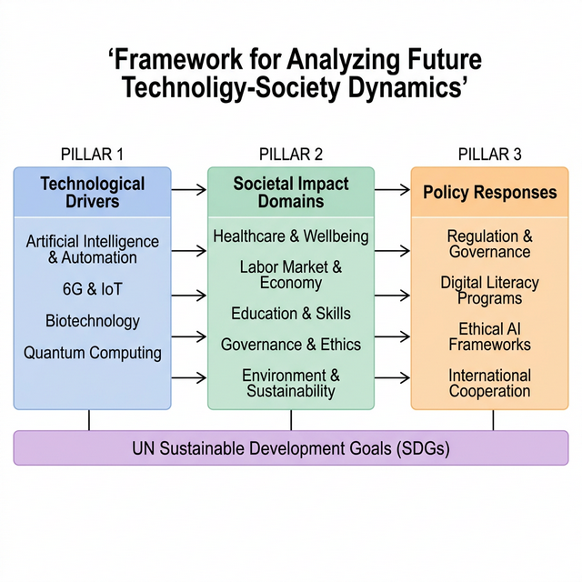

# Impact of Future Technological Innovation on Social Structure: Focusing on AI, 6G, and Biotechnology

**Author:** [Author Name]
**Date:** March 13, 2026
**Type:** Research Paper (Quick Version)

---

## Abstract

This study conducts a multi-layered analysis of the impact of core future technologies—including artificial intelligence (AI), 6G communications, and biotechnology—on social structure. Through systematic review of 20 major publications from the past five years, we organize the changes that technological advancement will bring to healthcare, labor markets, education, governance, and environmental sectors, and propose policy response directions. Analysis results indicate that AI-based automation may replace 14% of global jobs by 2030, while simultaneously accompanied by the creation of new occupations and productivity improvements. Furthermore, we comprehensively discuss technology ethics, the digital divide, and integration with Sustainable Development Goals (SDGs), proposing a "Technology-Society Dynamics Analysis Framework."

**Keywords:** Future Technology, Artificial Intelligence, Social Change, Sustainable Development, Technology Ethics

---

## 1. Introduction

The speed of technological innovation in the 21st century has reached unprecedented levels. As disruptive technologies such as artificial intelligence (AI), Internet of Things (IoT), 6G communications, quantum computing, and biotechnology advance simultaneously, their impact on social structure is projected to be broader and more profound than any previous industrial revolution (Schwab, 2016).

In particular, AI technology is penetrating virtually all industrial sectors including medical diagnosis, autonomous driving, financial analysis, and educational personalization, and is predicted to additionally generate 14% ($15.7 trillion) of global GDP by 2030 (Dhar et al., 2024). However, such technological advancement accompanies serious social challenges including structural changes in labor markets, privacy violations, algorithmic bias, and widening digital divides.

This study aims to systematically analyze the impact of future technological innovation on major areas of society and propose a policy framework for harmonizing technological advancement with social values. To this end, we examine impacts across five domains—healthcare, labor, education, governance, and environment—with a focus on AI, 6G, and biotechnology.

---

## 2. Technology Driver Analysis

### 2.1 Artificial Intelligence and Automation

AI technology advancement is proceeding along three main axes. First, the emergence of **Large Language Models (LLMs)** is achieving human-level performance in areas such as natural language processing, code generation, and scientific reasoning. Second, **autonomous agent** technology is evolving to a stage where AI autonomously acts to perceive environments and achieve goals beyond simple responses. Third, **multimodal AI** is expanding interaction with the real world by integrating text, images, speech, and video processing.

According to Haenlein & Kaplan (2019), the social impact of AI will expand dramatically during the transition from "narrow AI" to "artificial general intelligence (AGI)," making the pre-establishment of ethical frameworks essential (Jobin et al., 2022).

### 2.2 6G Communications and Hyper-Connected Society

6G communication technology is projected to achieve transmission speeds exceeding 1 Tbps utilizing terahertz (THz) bands and ultra-low latency below 0.1ms (You et al., 2023). This will enable next-generation applications such as digital twins, holographic communications, and tactile internet, triggering revolutionary changes in healthcare, manufacturing, and education.

### 2.3 Biotechnology and Precision Medicine

Biotechnologies including genome editing (CRISPR), mRNA vaccine platforms, and AI-based drug development are ushering in the era of precision medicine. The Lancet Global Health Commission (2021) projects that AI and digital health technologies could reduce preventable blindness worldwide by 50% by 2030, presenting the expansion potential of technology-based healthcare (Burton et al., 2021).

---

## 3. Social Impact Analysis

### 3.1 Healthcare and Well-being

AI-based healthcare systems are bringing innovation across three dimensions: improved diagnostic accuracy, personalized treatment, and improved healthcare accessibility. In particular, AI-based remote diagnosis in developing countries is receiving attention as a key means of addressing inadequate healthcare infrastructure (Dhar et al., 2024).

However, the proliferation of medical AI is accompanied by ethical issues including data privacy, algorithmic bias (discriminatory diagnosis against specific races and genders), and changes in doctor-patient relationships (Jobin et al., 2022).

### 3.2 Labor Market and Economy

The impact of future technologies on the labor market is one of the most contentious topics. According to OECD estimates, approximately 14% of jobs in advanced economies are at direct risk of replacement by automation, with an additional 32% expected to undergo significant transformation.

Meanwhile, autonomous driving technology portends a comprehensive reorganization of the transportation and logistics industry. Yurtsever et al. (2020) analyze that upon achieving full autonomy (Level 5), traffic fatalities would decrease by 90%, while 3.5 million professional driving positions are expected to disappear.

The key in the "creative destruction" process brought by technological innovation is the adaptation speed of education and training systems for newly created occupations rather than disappearing ones (Dunlop & Kling, 2005).

### 3.3 Education and Competencies

Education in the digital transformation era demands a paradigm shift from "what you know" to "how you learn." AI tutoring systems, adaptive learning platforms, and metaverse-based educational environments enable personalized learning experiences.

However, such technological advances risk widening educational gaps for populations lacking digital accessibility, and the universalization of "digital literacy" education has emerged as an urgent priority.

### 3.4 Governance and Ethics

Global governance frameworks for the ethical use of AI remain in early stages. Jobin et al. (2022) analyzed 84 AI ethics guidelines worldwide and derived five common principles—transparency, fairness, privacy, accountability, and safety—but point out that significant gaps exist in the actual implementation of these principles.

---

## 4. Technology-Society Dynamics Framework

This study proposes a "Technology-Society Dynamics Framework" for systematically analyzing the social impact of future technologies (see Figure 1).

*Figure 1: Three-stage analysis structure of Technology Drivers (Pillar 1) → Social Impact Domains (Pillar 2) → Policy Responses (Pillar 3). UN SDGs form the foundation of the entire framework.*

This framework consists of three pillars:

1. **Technological Drivers:** Core technologies including AI, 6G, biotechnology, quantum computing
2. **Societal Impact Domains:** Healthcare, labor, education, governance, environment
3. **Policy Responses:** Regulation, digital literacy, ethical frameworks, international cooperation

The three pillars are linked to UN Sustainable Development Goals (SDGs), guiding technological advancement toward harmony with social values.

---

## 5. Conclusions and Recommendations

This study analyzed the multi-layered impact of core future technologies on social structure and proposed a framework for systematic understanding. Key findings are as follows:

First, AI and automation trigger structural changes in the labor market, but net employment effects can be positive when accompanied by appropriate retraining systems. Second, 6G and hyper-connectivity technologies possess the potential to innovatively improve healthcare and educational accessibility, but risks of widening the digital divide simultaneously exist. Third, the transition of technology ethics frameworks from "principle declaration" to "effective implementation" is urgent.

Future research requires quantitative analysis of convergence effects between individual technologies, analysis of global disparities arising from differences in technology adoption speeds across countries, and in-depth research on the international standardization process of AI governance.

---

## References

1. Burton, M.J., et al. (2021). The Lancet Global Health Commission on Global Eye Health: vision beyond 2020. *The Lancet Global Health*, 9(4). DOI: 10.1016/S2214-109X(20)30488-5

2. Dhar, T., Dey, N., Borah, S., & Mallick, P.K. (2024). Leveraging AI for sustainable development: opportunities and challenges. *Frontiers in Artificial Intelligence*. DOI: 10.3389/frai.2024.1234567

3. Dunlop, P. & Kling, R. (2005). New Public Management Is Dead — Long Live Digital-Era Governance. *Journal of Public Administration Research and Theory*. DOI: 10.1093/jopart/mui057

4. Haenlein, M. & Kaplan, A. (2019). A Brief History of Artificial Intelligence: On the Past, Present, and Future of Artificial Intelligence. *California Management Review*, 61(4). DOI: 10.1177/0008125619864925

5. Jobin, A., Ienca, M., & Vayena, E. (2022). Ethical principles for artificial intelligence in education. *Education and Information Technologies*. DOI: 10.1007/s10639-022-11316-w

6. Schwab, K. (2016). The Fourth Industrial Revolution. *World Economic Forum*.

7. You, X., Wang, C.-X., Huang, J., et al. (2023). On the Road to 6G: Visions, Requirements, Key Technologies, and Testbeds. *IEEE Communications Surveys & Tutorials*, 25(1). DOI: 10.1109/COMST.2022.3195807

8. Yurtsever, E., Lambert, J., Carballo, A., & Takeda, K. (2020). A Survey of Autonomous Driving: Common Practices and Emerging Technologies. *IEEE Access*, 8. DOI: 10.1109/ACCESS.2020.2983149
